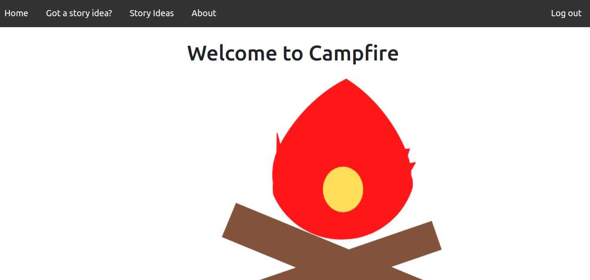

# CampFire
Campfire is ment to be used as an aspiring writters main tool for insparation, and where people who dont quite have the right creativity to share their story ideas.

# Getting started 
Trello board [here](https://trello.com/b/d4QahLWa/campfire)

Wireframe [here](https://whimsical.com/campfire-3eDWhepjumLpBnzVfmDnmy)

[Deployement](https://campfire-erodri6z.herokuapp.com/)

# Technologies Used
### Code

### Tools

# Next Steps 

- Add the ability to like and dislike
- Add the ability to build apon ideas
- Add the ability to add charecter ideas
- Improve on Styling